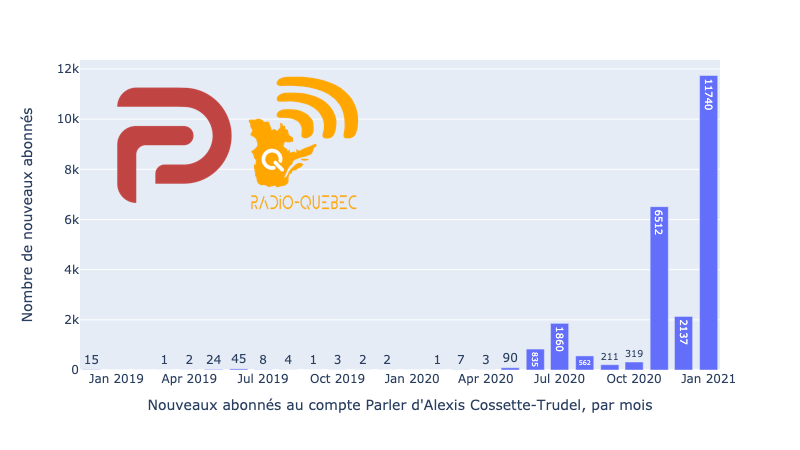

# La «parlersphère» canadienne

Le 10 janvier 2021, moins de 24 heures avant que le réseau social [Parler](https://parler.com/) ne soit [rendu inaccessible par Amazon](https://www.lemonde.fr/pixels/article/2021/01/11/parler-gab-telegram-apres-twitter-les-pro-trump-en-quete-de-nouveaux-reseaux-sociaux_6065899_4408996.html), j'ai voulu puiser le plus de contenu canadien possible de cette plateforme.

### Élus canadiens

J'ai d'abord utilisé la base de données [Represent, d'Open North](https://represent.opennorth.ca/) qui contient les noms de tous les élus de toutes les législatures canadiennes (les Communes et toutes les assemblées législatives provinciales). En réunissant les noms et partis de tous les élus, j'ai confectionné le fichier [**tousElus.csv**](tousElus.csv).

En me servant d'une bibliothèque python appelée [parler-api](https://gitlab.com/coffeemaninc/parler-api), j'ai rédigé un premier script qui vérifiait si les noms des élus se trouvaient: [**parlotte1.py**](parlotte1.py).

En nettoyant le fichier produit par ce premier script, et qui contenait plus de 5000 résultats, j'en ai effectué le nettoyage manuellement pour retrancher les comptes manifestement bidon. Je n'ai trouvé qu'une douzaine d'élus **potentiellement sur Parler**, ce qui est rassurant:

| Élu                    | Assemblée    | Circonscription                              | Parti                     | Pseudo Parler  |
|------------------------|--------------|----------------------------------------------|---------------------------|----------------|
| Drew Barnes            | Alberta      | Cypress-Medicine Ha                          | United Conservative Party | DrewBarnes     |
| Jason Nixon            | Alberta      | Rimbey-Rocky Mountain House-Sundre           | United Conservative Party | JasonNixon     |
| Nicholas Milliken      | Alberta      | Calgary-Currie                               | United Conservative Party | NACMilliken    |
| Bob Zimmer             | Communes     | Prince George--Peace River--Northern Rockies | Conservateur              | BobZimmerMP    |
| Candice Bergen         | Communes     | Portage--Lisgar                              | Conservateur              | CandiceBergen  |
| Derek Sloan            | Communes     | Hastings--Lennox and Addington               | Conservateur              | dereksloanCPC  |
| ~~Erin O'Toole~~           | ~~Communes~~     | ~~Durham~~                                       | ~~Conservateur~~              | ~~ErinOToole~~    |
| Greg McLean            | Communes     | Calgary Centre                               | Conservateur              | GregMcLeanYYC  |
| Matt Jeneroux          | Communes     | Edmonton Riverbend                           | Conservateur              | jeneroux       |
| Michelle Rempel Garner | Communes     | Calgary Nose Hill                            | Conservateur              | MichelleRempel |
| Tom Kmiec              | Communes     | Calgary Shepard                              | Conservateur              | TomKmiec       |
| Randy Hillier          | Ontario      | Lanark--Frontenac--Kingston                  | Indépendant               | RandyHillier   |
| Greg Ottenbreit        | Saskatchewan | Yorkton                                      | Saskatchewan Party        | GregOttenbreit |

Je dis bien **potentiellement**, car après que le compte au nom du [chef conservateur Erin O'Toole](https://parler.com/profile/erinotoole) est devenu inaccessible en soirée, dimanche, j'ai posté [ceci sur Facebook](https://www.facebook.com/jhroy/posts/10157827575106218). Or, il s'avère que le compte n'est pas authentique, [selon l'attachée de presse de M. O'Toole](https://twitter.com/Melanie_Paradis/status/1348077649743278080). J'ai donc rayé la ligne sur M. O'Toole ci-dessous. Si vous consultez la capture d'écran de la cache de Google pour le compte en question ([capture de la cache de Google effectuée le 11 janvier](images/Screenshot_2021-01-11--Parler-Erin_O’Toole.png)), vous constaterez que le contenu reprend les messages diffusés sur d'autres réseaux sociaux du chef conservateur et que si le compte n'est pas authentique, ce n'était pas un pastiche destiné à se moquer de lui.


### Radio-Québec

Après avoir consulté différents comptes québécois sur Parler, celui d'Alexis Cossette-Trudel a semblé être celui qui comptait le plus d'abonnés, soit près de 25&nbsp;000.

J'ai donc rédigé un deuxième script pour recueillir des informations sur tous les abonnés de M. Cossette-Trudel. Il peut être utilisé pour recueillir les *followers* de tout compte Parler, ainsi que les abonnés que ce compte suit à son tour: [**parlotte2.py**](parlotte2.py).

Parmi les informations que nous retourne Parler sur un compte donné se trouve la variable ```joined```, qui nous informe du moment précis où l'abonné a joint Parler. Dans mon cas, la valeur de cette variable est ```20200726154623```, ce qui signifie que je me suis joint au réseau social le 26 juillet 2020 à 15:46:23 très précisément.

Le script produit un fichier csv avec les nom, pseudonyme, biographie, *id* Parler et date d'adhésion à Parler de tous les abonnés d'un compte Parler donné (en l'occurrence, Radio-Québec): [**radioquebec.csv**](radioquebec.csv).

En consultant la date d'adhésion des abonnés de Radio-Québec, on constate qu'il y a eu une véritable ruée sur Parler depuis le début de 2021. Le compte de M. Cossette-Trudel a gagné plus de 11&nbsp;000 abonnés seulement dans les 10 premiers jours de l'année! Le nombre de personnes qui le suivent a presque doublé, passant de 13&nbsp;877 à 24&nbsp;384 entre le 31 décembre 2020 et le 10 janvier 2021 vers 15h.


